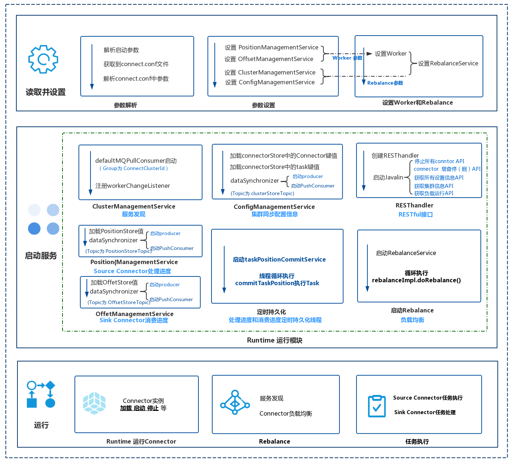

# 启动流程

## 快速启动



## 启动流程

启动过程总共分为三个阶段：**读取并设置参数**、**启动服务、运行，**每个阶段包含多个子模块。

### 读取并设置参数

此阶段是Runtime启动初始化阶段，主要是处理**JVM参数**和`connect.conf`  配置文件的参数,包含了：

* 参数解析
* 设置Runtime运行环境重要模块: **服务发现，集群配置信息同步，Source/Sink 消费进度，持久化线程，负载均衡以及RESTful接口**
* 设置worker参数，并装载相关模块

更多参数配置请参考：



### 启动服务

该阶段主要是启动Connector运行所需的所有环境，包含了多个模块：

#### 1. 服务发现

常用的服务发现组件如Dubbo可以用zk，RocketMQ的Namesrv，RocketMQ Connect因为依赖了RocketMQ ，借助的是RocketMQ 的机制。集群中的每个节点都订阅相同的Topic，并且上线下线都发送节点信息到Topic，并且每隔一段时间向节点上报心跳信息，每次都同步节点保存的当前的全量节点信息，如果有节点尝试见没有心跳会剔除节点信息。这样就做到了节点见间的服务发现。节点信息就是节点唯一标识和节点上报心跳时间**。**

#### **2. 集群配置信息同步**

配置信息，集群中每个Worker节点启动Connector相关的配置信息，也会像集群信息一样在集群中每个节点全量同步，同时会持久化到每个节点。

每个runtime在本地都会有四个配置信息文件,在Runtime参数 `storePathRootDir` 所指定的文件夹中,其中两个配置文件包含了Connector的相关配置信息。

* **connectorConfig.json** 

     connector 实例的参数设置，包含了connector运行的**Topic设置、集群信息和任务信息等。**


每个connector的配置参数不完全一样，具体配置请参考对应的Connector**配置参数说明。**


* **taskConnfig.json**

      Task执行设置参数存储，规定了Task的具体任务。


**可以使用RESTful接口中的getConfigInfo获取配置信息列表，具体请查看**

\*\*\*\*[**RESTful 接口**](restful-jie-kou.md) ****


#### 3. RESTful 接口

* 负责一个Connector的启动，停止，删除
* 获取设置信息和负载信息

具体信息请参考



#### 4. Source/Sink Connector 处理消费进度

**positionManagementSevice**和**offsetManagementSevice是**一对相互的服务，其中前者对应Source Connector的处理进度，后者对应Sink Connector的处理进度。

在Runtime参数 `storePathRootDir` 所指定的文件夹中,其中两个配置文件有配合对应Service文件

* **position.json**

      ****positionManagementSevice运行的同步信息文件，Source connector的处理进度

* **offset.json**

      ****offsetManagementSevice运行的同步信息文件，Sink connector的处理进度

#### 5.  定时持久化

该模块每隔一定时间进行一次进度持久化,将消息**写入RocketMQ的Broker集群中，**分别会处理

connectorConfig.json，taskConfig.json，position.json，offset.json四个文件。

​具体时间间隔的参数配置请参考



#### **6. 负载均衡**

RocketMQ Connect负载均衡跟RocketMQ Consumer和Queue之间的负载均衡类似，都是每个节点运行相同的负责均衡算法计算本节点应该处理的Task。

RocketMQ Connect集群中如果有节点挂掉，集群信息会发生变化，每个节点检查到集群信息发生了变化就会出发负载均衡，对集群中运行的Connector， Task重新分配，从而保证故障节点的任务分配到其它接单处理。

### 运行

除了启动服务阶段的服务外，运行阶段主要是**运行connector、负载均衡、task任务执行**三个部分：

* **运行connector**

      ****运行Connector，包含一个Connector的类**加载、启动、停止**等过程。

* **负载均衡**

      ****在运行期间，负载均衡包含**RocketMQ集群负载均衡、Worker负载均衡**两部分，定期会进行负载均衡重设置。

      RocketMQ Connect集群中如果有节点挂掉，集群信息会发生变化，每个节点检查到集群信息    发生了变化就会出发负载均衡，对集群中运行的Connector， Task重新分配，从而保证故障节点的任务分配到其它接单处理

* **task任务执行**

       ****在runtime中根据taskConfig的任务列表运行task，task任务跟Topic密切相关。

 

\*\*\*\*

\*\*\*\*

